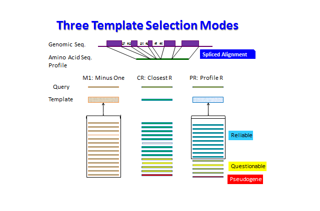

# Refgs.pl

### Refinement of gene structure prediction by iteration

*   [Overview](#Ov)
*   [Install](#Inst)
*   [Sequence File](#Sf)
*   [Run refgs.pl](#Run)
*   [Run refgs3.pl](#Run3)
*   [Reference](#Ref)

* * *

## <a name="Ov">Overview</a>

Refgs.pl [[1]](#Ref1) is a perl script to perform refinement of eukaryotic gene structure prediction by iteratively applying **aln** for prediction and **prrn** for assessment. 

## <a name="Inst">Install</a>

To run **refgs.pl**, **aln**, **prrn**, and several other programs, as well as several perl scripts, must be properly installed. Please refer to the documents of [**aln**](./readme_aln.md), and [**prrn**](./readme_prrn.md) for installing these programs. Moreover, you must prepare _seqdb_ directory where indexed and formatted genomic sequences are stored and _table_ directory where various tables used by **aln** and **prrn** are stored. `make install` command in the _src_ directory will generate these directories under your home directory by default, but you can change the locations of these directories at the time of ./configure. (Type ./configure --help for more information.) It is also possible to specify the locations of _seqdb_ and _table_ by 'env' variables ALN_DBS and ALN_TAB, respectively.


## <a name="Sf">Sequence File</a>

### Genomic sequences

The genomic sequence should be provided in the generally used FASTA format. However, refgs.pl imposes a few specific rules.

1. The file name should be xxxxxxxx_g.gf, where xxxxxxxx is an eight-character identifier of the genome. Each x should be in lower case. For example, the file name of human genomic sequence would be 'homosapi_g.gf'.
2. Each entry within a FASTA file should have the form >Xxxxxxx.... The first eight characters must be the same as the first eight characters of the file name, except that the first character should be in upper case, e.g. >HomosapiChr1. The part ... may be composed of any non-space characters, but they must be unique within each file. There is no length limitation in the entry ID, but excessively long ID would be inconvenient in later processes.
3. % makeidx.pl xxxxxxxx_g.gf
command in the seqdb directory will generates several files necessary for access to the genomic sequences by **aln**.

### Gene-structure-supplemented amino acid sequences

The amino acid sequences given in the _Before_ directory should contain information about the gene organization of the parental gene. The details of this 'extended FASTA format' is described in the [main document](./README.md).

### GSA-MPSA

When Seq1, Seq2, ..., Seq_n_ are gene-structure-supplemented amino acid sequences included in the _Before_ directory, the command
```
% prrn -s Before -o MSA Seq1 Seq2 ... Seq_n
```
will generate the initial GSA-MPSA to be refined.

## <a name="Run">Run refgs.pl</a>

The most typical usage of refgs.pl is as follows:
```
% refgs.pl -sBefore -tAfter -IN [-R|-R1] [other options] MSA
```

```
Before:	The directory that stores the predicted amino acid sequences before 
	refinement. Each sequence should be supplemented with exon-intron 
	structural information of the corresponding parental genes 
After:	The directory where the results of refinement will be stored.
-IN:	Maximum number of iterations (N = 1 by default)
-R:	Template selection mode CR (closest reliable, code = 1)
-R1:	Template selection mode PR (profile of reliable, code = 2)
none:	Template selection mode M1 (minus one, code = 0)
-aN:	Significance level of outlier analysis (default = 0.1)
-k:	In the default setting, the sequences judged to be pseudogene products 
	are eliminated from updated MSAs. With the -k option, all sequences in 
	the input are kept unremoved in the updated MSAs.
-lN:	The length of the left margin from the current translation initiation 
	site to be analyzed by the next cycle of aln.
-rN:	The length of the right margin from the current translation termination
	site to be analyzed by the next cycle of aln.
-uA:	Diagnose reliability of each predicted gene structure.
MSA:	Gene-structure-aware multiple protein sequence alignment (GSA-MPAS) 
	constructed from aa sequences in Before directory
```

At each refinement step, new MSA files, MSA.1, MSA.2, ... will be generated. The last file MSA._N_ is constructed from the updated amino acid sequences in _After_. The three template selection modes are illustrated below.



## <a name="Run3">Run refgs3.pl</a>

As described in Ref. [[1]](#Ref1), a combination of different template selection modes improves overall quality of refinement by **refgs.pl**. **Refgs3.pl** is designed to facilitate this procedure. In **Refgs3.pl**, the directory names are fixed; _prd_, _prd1_, _prd2_, _prd3_ are used as _Before_ and consecutively refined _After_ directories. The initial MSA before refinement should be named 'MSA._n_', where _n_ is a numeral. The final MSA file is named TRD._n_. All intermediate MSA files are reserved. Alternatively, you may give a UPGMA tree file as the argument. In that case, the initial MSA will be generated from the sequences in the _prd_ directory using the given tree as the guide tree. 
```
% refgs3.pl [-sBefore] [-mfst] upgma_tree.n
% refgs3.pl [-f1] [-sBefore] [-mfst] MSA.n
```
By default, a series of CR-M1-PR (102) template selection modes are used. The -mfst option can change this series, where _f_, _s_, and _t_ are codes (0, 1, or 2) shown above. If only _f_ or _f_ and _s_ are specified, the series will be stopped after the first or the second stages.

When the initial MSA is given or constructed, **refgs3.pl** tries to remove redundant sequences and minor isoforms derived from the same genomic region. With -f1 option, this step can be skipped.

## <a name="Ref">Reference</a>

<a name="Ref1">[[1]](http://www.biomedcentral.com/1471-2105/15/189) Gotoh, O., Morita, M. Nelson, D.R. (2014) "Assessment and refinement of eukaryotic gene structure prediction with gene-structure-aware multiple protein sequence alignment", _BMC Bioinformatics_ **15**:189.

* * *

Copyright (c) 2014-2017 Osamu Gotoh (o.gotoh@aist.go.jp) All Rights Reserved.

